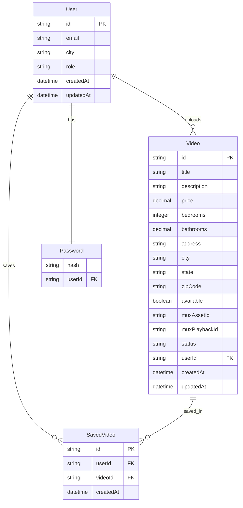

# Data Types Documentation

## Core Types

### User
- `id`: string (CUID)
- `email`: string (unique)
- `city`: string (nullable)
- `role`: string (default "RENTER")
- `createdAt`: datetime
- `updatedAt`: datetime

### Password
- `hash`: string
- `userId`: string (FK to User, unique)

### Video
- `id`: string (CUID)
- `title`: string
- `description`: string (nullable)
- `price`: decimal (nullable)
- `bedrooms`: integer (nullable)
- `bathrooms`: decimal (nullable)
- `address`: string (nullable)
- `city`: string (nullable)
- `state`: string (nullable)
- `zipCode`: string (nullable)
- `available`: boolean (default true)
- `muxAssetId`: string (nullable)
- `muxPlaybackId`: string (nullable)
- `status`: string (default "pending")
- `userId`: string (FK to User)
- `createdAt`: datetime
- `updatedAt`: datetime

### SavedVideo
- `id`: string (CUID)
- `videoId`: string (FK to Video)
- `userId`: string (FK to User)
- `createdAt`: datetime

## Relationships
- User has one Password (one-to-one)
- User uploads many Videos (one-to-many)
- User saves many Videos through SavedVideo (many-to-many)

## Indices
- `User`: email (unique)
- `Video`: userId, city
- `SavedVideo`: userId, videoId (unique together), separate indices on both

## Notes
- Using existing CUID strategy for IDs
- All date fields default to now() for created, auto-update for updated
- Maintained existing Mux integration fields
- Added indices for common query patterns
- All listing-specific fields are nullable since not all videos may be listings
- Cascading deletes configured on parent-child relationships

